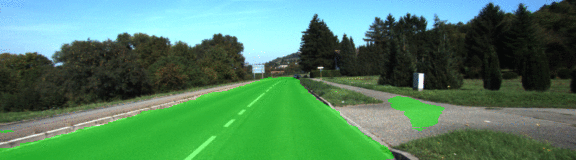
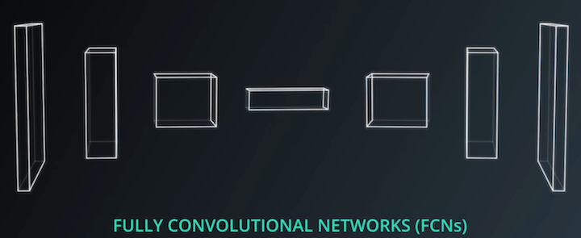

# Semantic Segmentation Project
[](http://www.udacity.com/drive)

This project uses a Fully Convolutional Network (FCN) to classify areas of road/non-road in a series of images.  The process of semantic segmentation assigns an object classification to _each pixel_ of an image.  The FCN used in this project mimics the one built in [Fully Convolutional Networks for Semantic Segmentation](https://people.eecs.berkeley.edu/~jonlong/long_shelhamer_fcn.pdf).


## Dependencies
Make sure you have the following is installed:
- [Python 3](https://www.python.org/)
- [TensorFlow](https://www.tensorflow.org/)
- [NumPy](http://www.numpy.org/)
- [SciPy](https://www.scipy.org/)
## Dataset
Download the [Kitti Road dataset](http://www.cvlibs.net/datasets/kitti/eval_road.php) from [here](http://www.cvlibs.net/download.php?file=data_road.zip).  Extract the dataset in the `data` folder.  This will create the folder `data_road` with all the training a test images.

The dataset consists of 289 training and 290 test images with three different categories of road scenes:
- uu - urban unmarked (98/100)
- um - urban marked (95/96)
- umm - urban multiple marked lanes (96/94)

## Runing the Code
Run the following command to run the project:
```
python main.py
```
**Note** If running this in Jupyter Notebook system messages, such as those regarding test status, may appear in the terminal rather than the notebook.

# Project Goals and [Rubric](https://review.udacity.com/#!/rubrics/989/view)
The goals of this project are the following:

* The function `load_vgg` is implemented correctly.
* The function `layers` is implemented correctly.
* The function `optimize` is implemented correctly.
* The function `train_nn` is implemented correctly.
* Ensure all the unit tests.
* The loss of the network should be printed while the network is training.

## FCN Architecture
Fully convolutional networks are trained end-to-end and include an encoding/decoding phase that preserves spatial information throughout the entire network.  Included with the decoding phase are skip connections.



### Layers
```
layer_7_conv: conv2d(kernel_size=1, strides=(1, 1))
layer_7_upsampled: conv2d_transpose(kernel_size=4, strides=(2, 2))
layer_4_conv: conv2d_transpose(kernel_size=1, strides=(1, 1))
layer_4_skip: add(layer_7_upsampled, layer_4_conv)
layer_4_upsampled: conv2d_transpose(kernel_size=4, strides=(2, 2))
layer_3_conv: conv2d_transpose(kernel_size=1, strides=(1, 1))
layer_3_skip: add(layer_4_upsampled, layer_3_conv)
```

Each convolution uses a kernal initializer and regularizer.

### Hyperparameters
The GPU would complain of memory errors until batch size was lowered to 12.

- Kernel Standard Deviation = 1e-3
- L2 Regularizer = 1e-5
- Keep Probability = 0.5
- Learning Rate = 1e-4
- Total Epochs = 20
- Batch Size = 12
- Number of Classes = 2
- Image Shape = (160, 576)

# Results
After twiddling the hyperparameters a bit, the model trained well and the FCN classifies the road/non-road areas well.

| Epoch | Loss      | Avg IoU  | Total Time |
|:-----:|:---------:|:--------:|:----------:|
| 1     | 0.268156  | 0.172755 | 00:56      |
| 2     | 0.154972  | 0.107669 | 01:46      |
| 3     | 0.086536  | 0.080282 | 02:36      |
| 4     | 0.116603  | 0.066256 | 03:26      |
| 5     | 0.201908  | 0.057187 | 04:20      |
| 6     | 0.062740  | 0.051240 | 05:10      |
| 7     | 0.115725  | 0.046462 | 06:00      |
| 8     | 0.073453  | 0.042688 | 06:50      |
| 9     | 0.069397  | 0.039528 | 07:41      |
| 10    | 0.043299  | 0.036875 | 08:31      |
| 11    | 0.059096  | 0.034608 | 09:24      |
| 12    | 0.081155  | 0.032697 | 10:14      |
| 13    | 0.066446  | 0.031023 | 11:04      |
| 14    | 0.021787  | 0.029546 | 11:54      |
| 15    | 0.043094  | 0.028219 | 12:45      |
| 16    | 0.029002  | 0.027021 | 13:37      |
| 17    | 0.032497  | 0.025960 | 14:27      |
| 18    | 0.034578  | 0.025016 | 15:18      |
| 19    | 0.032550  | 0.024128 | 16:08      |
| 20    | 0.040829  | 0.023342 | 17:00      |

```
Training Model: 100%|██████████| 20/20 [17:00<00:00, 51.03s/Epoch]
```

# Lessons Learned
If the training set was larger, the accuracy would be better.  Larger training sets include more actual images (like the cityscapes dataset) and/or the use of **augmentation**.

Also, I would have liked to train the model for 3 classes instead of 2.
